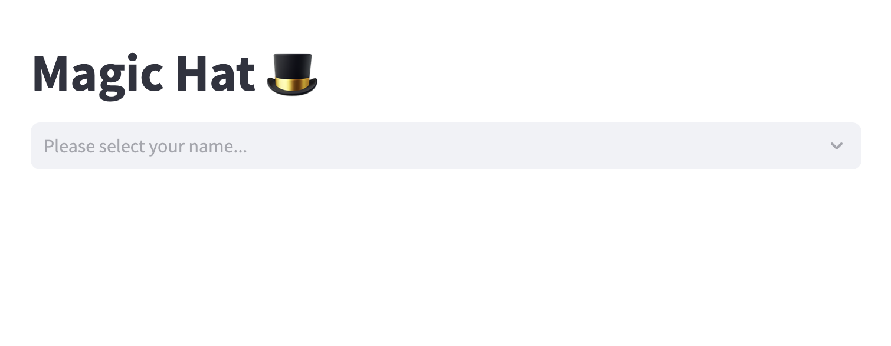

# Magic Hat for Secret Santa



## Initial members

[Google Sheets](https://docs.google.com/spreadsheets/d/1kws524HbFLr2Q_0_YeNgZ5FubDbUEVLzDNJz5HFK1Gw/edit?usp=sharing) used for initial databese creation. \
You **need to make a copy and edit** with your participants. 

1. Open [this link](https://docs.google.com/spreadsheets/d/1kws524HbFLr2Q_0_YeNgZ5FubDbUEVLzDNJz5HFK1Gw/edit?usp=sharing)
2. Press File -> Make a copy
3. Save under your account (You'll need Google Account)
4. Press Share -> General access set to Anyone with link -> Copy link
5. Replace `google_sheets_url` in `streamlit_app.py` with your link

You can edit **only yellow rows**. \
If you want to gift family member or all participants from different families just type for all differeft number in `family` column.

## PostgreSQL configuration

[Deploy an app and set up secrets](docs.streamlit.io/streamlit-community-cloud/deploy-your-app/secrets-management#deploy-an-app-and-set-up-secrets).

1. Take the example of config
2. Modify it with your data 
3. Add it to the [streamlit.io secrets section](https://docs.streamlit.io/streamlit-community-cloud/deploy-your-app/secrets-management#edit-your-apps-secrets)

Example of config:

```
[connections.postgresql]
dialect = "postgresql"
host = "xxxxxx"
port = "5432"
database = "xxxxxx"
username = "xxxxxx"
password = "xxxxxx"
```

where `host`, `port`, `database`, `username` and `password` replace with yours.

Free PostgreSQL nodes avalible on
[neon.tech](https://neon.tech/) or [elephantsql.com](https://www.elephantsql.com/) or wherever you want.

## Deploy

To deploy you need [streamlit.io](https://streamlit.io/) account and your own [github.com](https://github.com/) repository. 
1. Fork it 
2. Replace `google_sheets_url` in `streamlit_app.py`
3. Deploy your app on [streamlit.io](https://streamlit.io/)  and [add your secrets](https://docs.streamlit.io/streamlit-community-cloud/deploy-your-app/secrets-management#edit-your-apps-secrets).